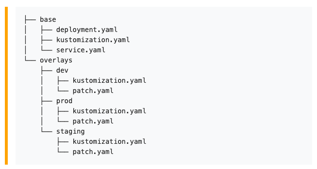

# Managing Kubernetes Resources with Namespaces
### Working with Namespace
* kubectl get namespaces
* kubectl run nginx --image=nginx --namespace=[insert-namespace-name-here]
* kubectl get pods --namespace=kube-system
* kubectl get pods -n kube-system
* kubectl config view | grep namespace
* kubectl config get-contexts
* kubectl config set-context --current --namespace=[insert-namespace-name-here]
* kubectl create namespace [insert-namespace-name-here]
* kubectl delete namespaces [insert-some-namespace-name] `Warning: Delete everything under namespace`

### Using Kustomize


* kubectl kustomize [kustomization_directory]
* kubectl apply -k [kustomization_directory]

### Switch context
* kubectl config current-context
* kubectl config get-contexts
* kubectl config use-context [context-name]
* kubectl config view
* cat ~/.kube/config

# Managing Kubernetes Resources with Labels
### Adding labels during build time
* kubectl create -f helloworld-pod-with-labels.yml

### Manage labels
* kubectl get pods --show-labels
* kubectl label [pod-name] app=helloworld `Adding label to rinning pods`
* kubectl label [pod-name] app=helloworldapp --overwrite `Update label`
* kubectl label [pod-name] app- `Delete label`
* kubectl get pods --show-labels `Deploy sample-infrastructure-with-labels.yml first`

### Label selectors
* kubectl get pods --selector env=production
* kubectl get pods --selector dev-lead=karthik
* kubectl get pods --selector dev-lead=karthik
* kubectl get pods -l release-version
* kubectl get pods -l dev-lead=karthik,env=staging
* kubectl get pods -l dev-lead!=karthik,env=staging
* kubectl get pods -l 'release-version in (1.0,2.0)' `Querying also supports the "in" keyword`
* kubectl get pods -l "release-version in (1.0,2.0),team in (marketing,ecommerce)"
* kubectl get pods -l 'release-version notin (1.0,2.0)' `Querying also supports the "notin" keyword`
* kubectl get all --show-labels `also work with services and deployments`
* kubectl delete pods -l dev-lead=karthik

### Node Selector
https://kubernetes.io/docs/concepts/scheduling-eviction/assign-pod-node

# Managing Kubernetes Resources with Annotations
```
  annotations:
    kubernetes.io/change-cause: "change navbar color"
```
* kubectl rollout history deployment/navbar-deployment
* kubectl rollout history deployment/navbar-deployment --revision=2
* kubectl annotate deploy/navbar-deployment kubernetes.io/change-cause="change navbar color"
* kubectl rollout undo deployment/navbar-deployment
* kubectl rollout undo deployment/navbar-deployment --to-revision=version